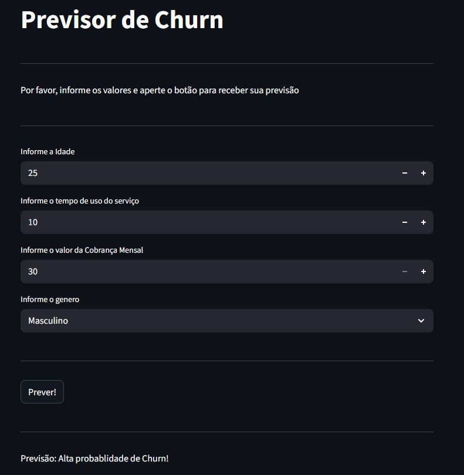
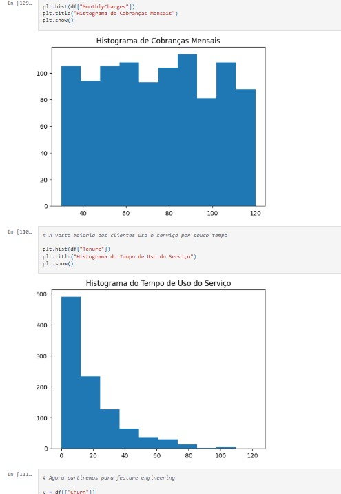

# Customer-Churn-Prediction-Machine-Learning  

  Este é um sistema que utiliza diversas técnicas de Machine Learning e Mineração de Dados para prever a taxa de Churn dos clientes de uma empresa.  
  
*Churn* (ou taxa de cancelamento) é uma métrica que mede a porcentagem de clientes que deixam de usar o produto ou serviço de uma empresa ao longo de um período de tempo específico, como um mês ou um ano. Em outras palavras, Churn é a taxa que mostra **quantos clientes uma empresa perdeu** em um período. Quanto menor o Churn, melhor a retenção e a saúde do negócio. É portanto fundamental que a empresa acompanhe o Churn para entender o quão bem estão retendo seus clientes e para identificar problemas que possam estar fazendo com que os clientes abandonem a empresa.  
  
Este sistema permite prever a probabilidade de um cliente abandonar a empresa dados diversos fatores, como idade, genero, tempo de uso do serviço, valores pagos pelo serviço, etc. Isso permite encontrar padrões valiosos para entender que medidas estratégicas devem ser adotadas para reter mais clientes.  

## Estrutura
- O arquivo "app.py" contem a estrutura central do sistema, ultilizando a biblioteca **streamlit** para criar uma interface permitindo ao usuário interagir com o modelo.

  

- O Jupyder Notebook "nodebook.ipynb" contem detalhes sobre o passo a passo do projeto, graficos e comentários sobre a analise dos dados e conclusões tiradas destes, assim como o código necessario para o setup, treinamento e analise de precisão do modelo.
  
  

A ETL e limpeza de dados são detalhadas no Jupyter Notebook, assim como a interpretação destes.

## Técnologias Utilizadas
- Para fins demonstrativos, o sistema ultilizou uma base de dados padrão fornecida pela [Kaggle](https://www.kaggle.com/datasets/abdullah0a/telecom-customer-churn-insights-for-analysis);
- O sistema depende de um ambiente utilizando **Python 3.11**;
- Técnologias de Machine Learning foram empregadas utilizando a biblioteca **sklearn**.

Os seguintes algoritmos de Machine Learning foram testados e estão disponiveis para uso no sistema:
- Regressão Logística
- K-Nearest Neighbors
- Support Vector Machine
- Arvores de Decisão
- Random Forest

Os testes também identificaram os parametros mais precisos para cada algoritimo aplicado a este problema especifico. Detalhes dos testes e seus resultados podem ser conferidos no Jupyter Notebook "nodebook.ipynb".
